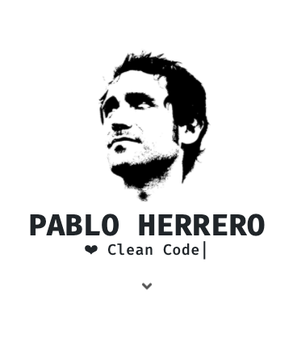

# **MY PORTFOLIO**  

My portfolio, handmade with love, is a SPA made with Angular and inspired on Dracula theme colors. These are its features:
  - Angular + Bootstrap 4.
  - Mobile first design.
  - Black & White + touches of Dracula.
  - Portfolio grid showing details when click.
  - Contact section with a reactive form.
  - Fixed footer section with social links and copyright reference.
  - Scrollspy
  - Custom button styles.
  - Some amazing libraries:
    - Typed.js JavaScript typing animation (https://github.com/mattboldt/typed.js/).
    - Animate.css (https://github.com/animate-css/animate.css).

> © 2020 Pablo Herrero
